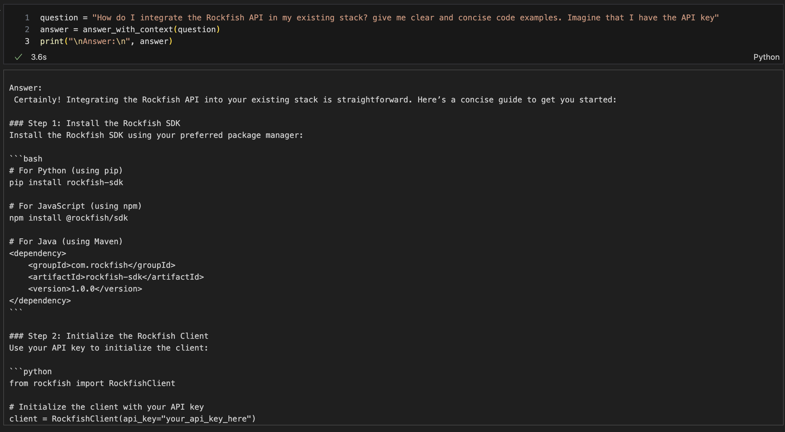

# 🚀 Rockfish RAG Chatbot

This repository contains the foundational pipeline for building a **Retrieval-Augmented Generation (RAG) chatbot** about Rockfish using data from multiple sources:

✅ Rockfish website  
✅ News articles  
✅ YouTube video transcripts  
✅ Research papers and documentation

## 📂 Project Overview

The chatbot is designed to **answer customer questions** about Rockfish’s mission, products, and insights by combining:

- 🌐 Web scraping and data ingestion  
- ✂️ Text chunking for semantic retrieval  
- 🔍 Dense embeddings and similarity search  
- 📦 ChromaDB as the vector store  
- 🤖 Generative LLMs for natural-sounding answers

[vid](https://github.com/user-attachments/assets/9d22462f-027f-496f-8067-e78852c51989)

## 🟩 Key Steps

1️⃣ **Data Extraction**  
- Scrape and clean text data from multiple sources (website, news, research papers, videos).

2️⃣ **Chunking & Storage**  
- Split data into overlapping chunks to enhance retrieval accuracy.  
- Store chunks in ChromaDB for efficient vector search.

3️⃣ **Dense Retrieval**  
- Generate vector embeddings for each chunk using HuggingFace models.  
- Retrieve top-k relevant chunks to provide context for answers.

4️⃣ **LLM-based Answer Generation**  
- Use retrieved chunks as context for generative LLMs to formulate customer-friendly answers.

## 🖼️ Media and Examples

### 📸 Screenshots

#### Example of Chunking

#### Example Text Chunk

#### LLM Integration

## 💡 Use Case

A **customer-facing chatbot** that leverages structured Rockfish-related data to:

✅ Provide accurate, relevant, and contextual answers.  
✅ Support product and service queries.  
✅ Deliver up-to-date information across channels (web, research, news, videos).

## 📝 Summary

This project lays the foundation for a robust RAG chatbot using **dense retrieval** and **generative LLMs**, backed by a diverse knowledge base about Rockfish.

